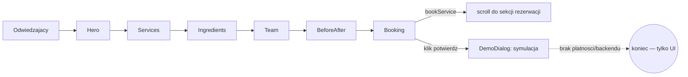

# ARCHITECTURE — mapa dla obcego (1 strona)

<!-- Cel: senior, ktory nigdy nie widzial repo, znajduje miejsce zmiany w 15 min. -->

## Co to jest (3 zdania)
Demo site "Eldfjall Beauty" — **fikcyjny** salon kosmetyczny w Reykjavíku, oparty na zabiegach
z islandzkimi surowcami naturalnymi (geotermalne błoto, mech, składniki wulkaniczne), zbudowany
jako pokazowy przykład dla klientów agencji [Reykjawwwik](https://reykjawwwik.is). Copy jest
**w całości po islandzku** — świadoma decyzja, bo dla tego segmentu klienta demo po angielsku
zaniżałoby przekaz. Zero prawdziwych klientów/rezerwacji/płatności.

## Stack (z package.json / README)
- Frontend: React + TypeScript, Vite, react-router-dom (1 realna trasa), TanStack Query (bez realnych zapytań)
- UI: Tailwind CSS + shadcn/ui (Radix), lucide-react
- Backend/DB: **brak** — demo nie ma nic do trwałego zapisu
- i18n: `src/i18n/LanguageContext.tsx` + `translations.ts` — UWAGA: `LanguageProvider` jest
  zamontowany w `src/pages/Index.tsx`, NIE w `App.tsx` (inaczej niż w siostrzanych demo repo floty)
- Osobne konteksty: `useDemo` (`src/hooks/useDemo.tsx`, modal informacyjny) i `useBooking`
  (`src/hooks/useBooking.tsx`, tylko zaznacza wybraną usługę + scrolluje do sekcji rezerwacji —
  BEZ zapisu czegokolwiek)
- Testy: Playwright E2E + Vitest (`src/test/`)
- Hosting: **Lovable** (`lovable-tagger` w `vite.config.ts`) — `git push` na `main` NIE deployuje,
  produkcję aktualizuje ręczny **Publish** w Lovable UI

## Moduły i granice (co jest gdzie)
| Katalog / plik | Odpowiedzialność | Tier |
|---|---|---|
| `src/pages/Index.tsx` | strona główna — montuje `LanguageProvider` i składa sekcje one-page | T1 |
| `src/components/Services.tsx` / `Pricing.tsx` | cennik zabiegów twarzy i ciała | T1 |
| `src/components/Ingredients.tsx` | prezentacja składników islandzkich (geotermalne, wulkaniczne, zioła) | T1 |
| `src/components/Booking.tsx` | sekcja rezerwacji — używa `useBooking` do zaznaczenia usługi | T1 |
| `src/components/DemoDialog.tsx` | modal demo (via `useDemo`) — podmienia realną akcję na komunikat | T1 |
| `src/components/GiftCards.tsx` | prezentacja kart podarunkowych, bez realnej płatności | T1 |
| `src/components/BeforeAfter.tsx` | galeria przed/po zabiegach | T1 |
| `src/i18n/*` | słownik i kontekst języka (domyślnie islandzki) | T1 |

## Przepływ użytkownika

## Gdzie jest…
- cennik zabiegów: `src/components/Services.tsx`, `src/components/Pricing.tsx`
- teksty (domyślnie IS, z możliwością przełączenia): `src/i18n/translations.ts`
- symulacja rezerwacji: `src/hooks/useDemo.tsx` + `src/components/DemoDialog.tsx`
- sekrety: brak (zero integracji zewnętrznych)

## Decyzje nieodwracalne
`docs/adr/` — zobacz istniejące ADR w repo.

## Jak to cofnąć / kill switch
Strona statyczna bez backendu — rollback = Lovable "Revert to this version" albo `git revert` + Publish.
